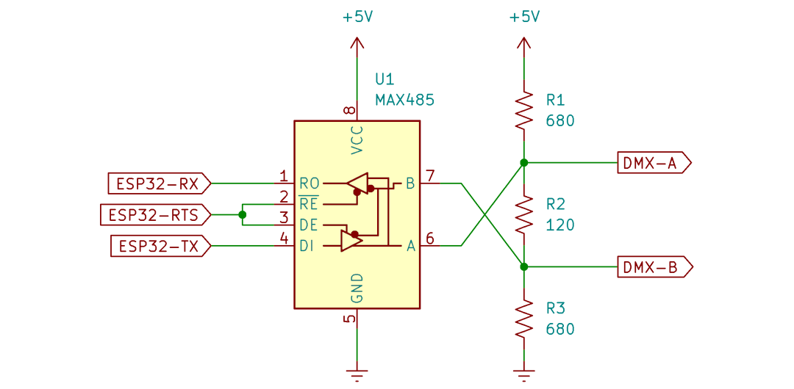

# esp_dmx

This library allows for transmitting and receiving ANSI-ESTA E1.11 DMX-512A and ANSI-ESTA E1.20 RDM using an Espressif ESP32. It provides control and analysis of the packet configuration and allows the user to read or write synchronously or asynchronously from the DMX bus using whichever hardware UART port that is desired. This library also includes tools for data error-checking to safely process DMX and RDM commands as well as DMX packet metadata extraction to assist with troubleshooting errors.

## Contents

- [Library Installation](#library-installation)
  - [Arduino](#arduino)
  - [ESP-IDF](#esp-idf)
  - [PlatformIO](#platformio)
- [Quick-Start Guide](#quick-start-guide)
- [What is DMX?](#what-is-dmx)
  - [What is RDM?](#what-is-rdm)
- [DMX Basics](#dmx-basics)
  - [Addresses and the Start Code](#addresses-and-the-start-code)
  - [Footprints](#footprints)
  - [Universes](#universes)
- [RDM Basics](#rdm-basics)
  - [Unique IDs](#unique-ids)
  - [Sub-devices](#sub-devices)
  - [Parameters](#parameters)
  - [Discovery](#discovery)
  - [Responses](#responses)
- [Configuring the DMX Port](#configuring-the-dmx-port)
  - [Installing the Driver](#installing-the-driver)
  - [Setting Communication Pins](#setting-communication-pins)
  - [Timing Configuration](#timing-configuration)
- [Reading and Writing DMX](#reading-and-writing-dmx)
  - [Reading DMX](#reading-dmx)
  - [DMX Sniffer](#dmx-sniffer)
  - [Writing DMX](#writing-dmx)
  - [DMX Parameters](#dmx-parameters)
- [Reading and Writing RDM](#reading-and-writing-rdm)
  - [RDM Requests](#rdm-requests)
  - [Discovering Devices](#discovering-devices)
  - [RDM Responder](#rdm-responder)
- [Error Handling](#error-handling)
  - [Timing Macros](#timing-macros)
  - [DMX Start Codes](#dmx-start-codes)
- [Additional Considerations](#additional-considerations)
  - [Using Flash or Disabling Cache](#using-flash-or-disabling-cache)
  - [Wiring an RS-485 Circuit](#wiring-an-rs-485-circuit)
  - [Hardware Specifications](#hardware-specifications)
- [To Do](#to-do)
- [Appendix](#appendix)
  - [Command Classes](#command-classes)
  - [NACK Reason Codes](#nack-reason-codes)
  - [Parameter IDs](#parameter-ids)
  - [Product Categories](#product-categories)
  - [Response Types](#response-types)

## Library Installation

### Arduino

This library requires the Arduino-ESP32 framework version 2.0.3 or newer. To install the correct framework, follow Espressif's instructions on the Arduino-ESP32 documentation page [here](https://docs.espressif.com/projects/arduino-esp32/en/latest/installing.html).

This library can be installed by cloning this repository into your your `Arduino/libaries` folder or by searching for `esp_dmx` in the Arduino IDE Library Manager. Then simply include the library by adding `#include "esp_dmx.h"` at the top of your Arduino sketch.

### ESP-IDF

This library requires ESP-IDF version 4.4.1 or newer. Clone this repository into your project's `components` folder. The library can be linked by writing `#include "esp_dmx.h"` at the top of your `main.c` file.

### PlatformIO

This library is compatible with the PlatformIO IDE. Search for this library in the PlatformIO library registry and add it to your project. The library can be included by writing `#include "esp_dmx.h"` at the top of your `main.c` or `main.cpp` file.

This library includes a `Kconfig` file for configuring build options on the ESP32. When using the ESP-IDF framework, it is recommended to move library folders to a `components` folder located in your project's root directory rather than leaving PlatformIO installed libraries in their default location. This is not required but it can result in more a more performant driver. See [Using Flash or Disabling Cache](#using-flash-or-disabling-cache) for more information.

## Quick-Start Guide

To get started, call the following code in your `setup()` function if using Arduino, or `app_main()` in your `main.c` file if using ESP-IDF.

```c
const dmx_port_t dmx_num = DMX_NUM_1;

// First, use the default DMX configuration...
dmx_config_t config = DMX_CONFIG_DEFAULT;

// ...declare the driver's DMX personalities...
const int personality_count = 1;
dmx_personality_t personalities[] = {
  {1, "Default Personality"}
};

// ...install the DMX driver...
dmx_driver_install(dmx_num, &config, personalities, personality_count);

// ...and then set the communication pins!
const int tx_pin = 17;
const int rx_pin = 16;
const int rts_pin = 21;
dmx_set_pin(dmx_num, tx_pin, rx_pin, rts_pin);
```

To write data to the DMX bus, two functions are provided. The function `dmx_write()` writes data to the DMX buffer and `dmx_send()` sends the data out onto the bus. The function `dmx_wait_sent()` is used to block the task until the DMX bus is idle.

```c
uint8_t data[DMX_PACKET_SIZE] = {0};

while (true) {
  // Write to the packet and send it.
  dmx_write(dmx_num, data, DMX_PACKET_SIZE);
  dmx_send(dmx_num);
  
  // Do work here...

  // Block until the packet is finished sending.
  dmx_wait_sent(dmx_num, DMX_TIMEOUT_TICK);
}
```

To read from the DMX bus, two additional functions are provided. The function `dmx_receive()` waits until a new packet has been received. The function `dmx_read()` reads the data from the driver buffer into an array so that it can be processed. If it is desired to process RDM requests, the function `rdm_send_response()` may be used.

```c
dmx_packet_t packet;
while (true) {
  int size = dmx_receive(dmx_num, &packet, DMX_TIMEOUT_TICK);
  if (size > 0) {
    dmx_read(dmx_num, data, size);

    // Optionally handle RDM requests
    if (packet.is_rdm) {
      rdm_send_response(dmx_num);
    }

    // Process data here...
  }

  // Do other work here...

}
```

That's it! For more detailed information on how this library works including details on RDM, keep reading.

## What is DMX?

DMX is a unidirectional communication protocol used primarily in the entertainment industry to control lighting and stage equipment. DMX is transmitted as a continuous stream of packets using half-duplex RS-485 signalling with a standard UART port. DMX devices are typically connected using XLR5 in a daisy-chain configuration but other connectors such as XLR3 are common in consumer products.

Each DMX packet begins with a high-to-low transition called the break, followed by a low-to-high transition called the mark-after-break, followed by an eight-bit byte. This first byte is called the start code. The start-of-packet break, mark-after-break, and start code is called the reset sequence. After the reset sequence, a packet of up to 512 data bytes may be sent.

DMX imposes very strict timing requirements to allow for backwards compatibility with older lighting equipment. Frame rates may range from 1fps to up to approximately 830fps. A typical DMX controller transmits packets between approximately 25fps to 44fps. DMX receivers and transmitters have different timing requirements which must be adhered to carefully to ensure commands are processed.

Today, DMX often struggles to keep up with the demands of the latest hardware. Its low data rate and small packet size sees it losing market popularity over more capable protocols. However its simplicity and robustness often makes it the first choice for small scale projects.

For in-depth information on DMX, see the [E1.11 standards document](https://tsp.esta.org/tsp/documents/docs/ANSI-ESTA_E1-11_2008R2018.pdf).

### What is RDM?

RDM stands for Remote Device Management. It is an extension to the DMX protocol to allow intelligent, bidirectional communication between devices from multiple manufacturers utilizing a modified DMX data link. RDM permits a console or other controlling device to discover and then configure, monitor, and manage intermediate and end-devices connected through a DMX network.

When RDM capable devices must be configured but are inconveniently out of reach, it is said that RDM is "faster than the ladder." Instead of needing to climb a ladder to reach a device users are able to make changes to device settings from their DMX controller.

For in-depth information on RDM, see the [E1.20 standards document](https://getdlight.com/media/kunena/attachments/42/ANSI_E1-20_2010.pdf).

## DMX Basics

In a typical configuration, a DMX system consists of one DMX controller and up to 32 DMX fixtures per DMX port. A five-pin XLR cable, commonly known as a DMX cable, is connected to the DMX-out port of the DMX controller and into the the DMX-in port of the first DMX fixture. Each subsequent fixture is connected by a DMX cable between the DMX-out port of the previous fixture and the DMX-in port of the next fixture. A DMX terminator may be connected to the DMX-out port of the final fixture. This is only required when using RDM but can be helpful to ensure DMX signal stability when connecting more than 32 fixtures or for long runs of DMX cable.

### Addresses and the Start Code

DMX addresses are needed for DMX controllers to communicate with fixtures. A fixture's address can be set between 1 and 512 (inclusive) by setting the fixture's DIP switches or by using the fixture's built-in display. DMX addresses correspond to DMX slots in a DMX packet. DMX address one is mapped to DMX packet slot one. Each DMX slot is an 8-bit number. A slot's minimum value is 0 and its maximum value is 255. To control a DMX dimmer set to DMX address five, DMX packet slot five must be written. To set the DMX dimmer to full intensity, slot five must be written to value 255. To set the dimmer to zero intensity, slot five must be written to value 0. Setting slot five to any value in between will dim the intensity appropriately.

Slot zero in the DMX packet is called the DMX start code. The start code informs DMX fixtures what type of packet is being sent. Standard DMX packets use a start code of `0x00`, also called the null start code. DMX fixtures will not respond to DMX packets unless the packet begins with a null start code! A list of the other supported start codes can be found in the [DMX start codes](#dmx-start-codes) section.

### Footprints

Many DMX fixtures support multiple controllable DMX parameters. Fixtures that support multiple parameters use multiple DMX addresses. An RGB LED fixture is a common example of a multi-parameter fixture. It uses three parameters: red, green, and blue. In this example, this fixture would therefore use three, consecutive DMX addresses. This is called the fixture's DMX footprint. The red, green, and blue parameters of an RGB LED fixture set to DMX address five can be controlled by writing to slots five, six, and seven, respectively. A fixture's DMX footprint can be found by reading its user manual. It is possible to address multiple DMX fixtures so that their DMX footprints overlap but this is uncommon.

Multi-parameter fixtures may support multiple footprints. On a fixture that supports multiple footprints, only one footprint can be active at a time. Larger footprints may be used to provide finer control of the fixture's DMX parameters. Conversely, smaller footprints may be used when finer control of a fixture is not needed. Instructions to change a fixture's active footprint may be found by consulting its user manual.

A fixture which supports multiple footprints is said to possess multiple personalities. Each DMX personality may support a different footprint.

### Universes

When more than 512 DMX addresses are used, it is required to use multiple DMX ports. Each DMX port is called a DMX universe. DMX fixtures can be uniquely identified by their DMX universe and address numbers. A common way to notate this is by separating the universe and address with a `/`. Therefore `3/475` represents universe three, address 475. It is important to understand that DMX fixtures are not aware of the concept of a universe. A fixture set to DMX address one will respond to writes to slot one on whichever universe to which it is connected.

## RDM Basics

Compared to DMX, RDM is a fairly complex protocol which utilizes different packet and data types depending on the information that is being requested. This library attempts to abstract away many of the details of the RDM implementation to facilitate code ease-of-use while still providing a powerful feature set. The following sections are intended to provide a introduction to RDM as it pertains to this library. For a more comprehensive introduction of RDM, see the [E1.20 standards document](https://getdlight.com/media/kunena/attachments/42/ANSI_E1-20_2010.pdf).

### Unique IDs

In an RDM network, there is one controller device and several responder devices. Each device in the network has a Unique ID (UID) which uniquely identifies itself against others in the network. If an RDM device has multiple DMX ports, it may possess multiple UIDs; one for each DMX port. UIDs are 48-bits long. The most-significant 16-bits are a device's manufacturer ID. Devices made by the same manufacturer have the same most-significant 16-bits. The remaining, 32 least-significant-bits are a device's device ID. Readers may draw a reasonable comparison to MAC addresses in IP networking equipment. Every IP capable device has at least one MAC address and if they have multiple network interfaces they may have multiple MAC addresses. Similarly, the most significant bits in a MAC address identify a network interface's manufacturer.

UIDs are represented in text by displaying the UID in hexadecimal and by separating the manufacturer ID from the device ID with a `:`. If a device has a manufacturer ID with a value of `0xabcd` and device ID with a value of `0x12345678`, its full UID would be displayed as `abcd:12345678`.

When a controller device composes an RDM request, it must be addressed using a destination UID. The recipient of a request may be a single device, by using the device's UID, or multiple devices, by using a broadcast UID. Broadcast UIDs can be addressed to every device of a specific manufacturer or to all devices on the RDM network. To send a manufacturer broadcast, the destination UID's manufacturer ID must match the manufacturer ID of the desired manufacturer, and the device ID must be `ffffffff`. To broadcast to every device with the manufacturer ID of `05e0`, the UID must be set to `05e0:ffffffff`. The UID used to broadcast to all devices on the RDM network is `ffff:ffffffff`.

The lowest possible UID is `0001:00000000` and the highest possible UID is `ffff:fffffffe`. In practice the manufacturer ID `ffff` is not permitted so real-world RDM devices would never possess a UID higher than `7fff:fffffffe`. This library represents the maximum UID with the constant `RDM_UID_MAX`.

Organizations may apply for a unique manufacturer ID by contacting ESTA. The instructions to do so and a list of registered manufacturer IDs can be found [here](https://tsp.esta.org/tsp/working_groups/CP/mfctrIDs.php). This software library is registered and listed with the manufacturer ID of `05e0`. Users of this library may use this manufacturer ID for their devices.

In this library, UIDs are represented with the `rdm_uid_t` type. The macro `rdm_uid_broadcast_man()` can be used to create a UID which broadcasts to the desired manufacturer ID and the constant `RDM_UID_BROADCAST_ALL` can be used to broadcast to all devices on the RDM network.

### Sub-devices

Each RDM device may support up to 512 sub-devices. An example of a device that may support sub-devices is a dimmer rack which possesses multiple dimmers. Requests may be addressed to a specific dimmer in the dimmer rack by addressing the dimmer rack's UID, and specifying a sub-device number to target the appropriate dimmer.

The sub-device number which represents the root device is `0x0000`. A request may also be addressed to all sub-devices of a root device by using the sub-device number `0xffff`. The constants `RDM_SUB_DEVICE_ROOT` and `RDM_SUB_DEVICE_ALL` are provided to improve code readability.

A root device and its sub-devices may support different RDM parameters, but each sub-device within a root device must support the same parameters as each other.

### Parameters

RDM requests must be able to fetch and update parameters. The RDM standard specifies more than 50 different Parameter IDs (PIDs) which a device may support. The standard also specifies that manufacturers may define custom PIDs for their devices.

Most PIDs can be either GET or SET if the responding device supports the requested PID. Some PIDs may support GET but do not support SET, and vice versa. Some PIDs may support both GET and SET. Three PIDs cannot be GET nor SET. These three PIDs are used for the RDM discovery algorithm. They are `DISC_UNIQUE_BRANCH`, `DISC_MUTE`, and `DISC_UN_MUTE`. This library provides constants for each PID. Each PID in this library is prefixed with `RDM_PID_`. Therefore, `DISC_UNIQUE_BRANCH` would become `RDM_PID_DISC_UNIQUE_BRANCH`. This document will refer to PIDs by their prefixed names for consistency of documentation.

RDM specifies that every device (but not its sub-devices necessarily) must support a specific set of PIDs to ensure proper communication between devices. The list of the supported and the required PIDs can be found in the [appendix](#parameter-ids).

GET requests may not be sent to all sub-devices of a root device. It is therefore not permitted to send a GET request to `RDM_SUB_DEVICE_ALL`.

### Discovery

When making RDM requests it is typically needed (but not required) to discover the UIDs of the devices on the RDM network. The discovery process begins with the controller device broadcasting an `RDM_PID_DISC_UNIQUE_BRANCH` command to all devices. The data included in this request consist of an address space defined by a UID lower bound and UID upper bound. Responding devices respond to `RDM_PID_DISC_UNIQUE_BRANCH` requests if their UID is greater-than-or-equal to the lower bound and less-than-or-equal to the upper bound. When multiple devices respond at the same time, data collisions can occur. When a data collision occurs, the controller divides the address space in two. An `RDM_PID_DISC_UNIQUE_BRANCH` request is sent to each new address space. This is repeated until a single device is found within an address space.

When a single device is found within an address space, that device is sent an `RDM_PID_DISC_MUTE` request to mute its response to future `RDM_PID_DISC_UNIQUE_BRANCH` requests. When responding to `RDM_PID_DISC_MUTE` requests, devices that have multiple RDM ports return a binding UID which represents its primary UID.

Some RDM devices act as proxy devices. A proxy device is any inline device that acts as an agent or representative for one or more devices. A proxy device shall respond to all controller messages on behalf of the devices it represents as if it is the represented device. If a device is acting as a proxy device or if it is proxied by another device, it will indicate so in its response to `RDM_PID_DISC_MUTE` and `RDM_PID_DISC_UN_MUTE` requests.

Discovery should be performed periodically as discovered devices may be removed from the RDM network or new devices may be added. Before restarting the discovery algorithm, a `RDM_PID_DISC_UN_MUTE` request should be broadcast to all devices in order to detect if devices were removed from the RDM network.

### Responses

Responding devices shall respond to requests only if the request was a non-broadcast request. Responding devices may respond to requests with the following response types:

- `RDM_RESPONSE_TYPE_ACK` indicates that the responder has correctly received the controller message and is acting upon the request.
- `RDM_RESPONSE_TYPE_ACK_OVERFLOW` indicates that the responder has correctly received the controller message and is acting upon the request, but there is more response data available than will fit in a single response packet. To receive the remaining information, controllers are able to send repeated requests to the same PID until the remaining information can fit in a single message.
- `RDM_RESPONSE_TYPE_ACK_TIMER` indicates that the responder is unable to supply the requested GET information or SET confirmation within the required response time. When sending this response, responding devices include an estimated response time that must elapse before the responder can provide the required information.
- `RDM_RESPONSE_TYPE_NACK_REASON` indicates that the responder is unable to reply with the requested GET information or unable to process the specified SET command. Responding devices must include a NACK reason code in their response. NACK reason codes are enumerated in the [appendix](#nack-reason-codes).

Two additional response types are defined for this library. These response types are included to assist users with processing RDM data.

- `RDM_RESPONSE_TYPE_NONE` indicates that no response was received.
- `RDM_RESPONSE_TYPE_INVALID` indicates that a response was received, but the response was invalid. This can occur for several reasons including an invalid checksum, or an invalid packet format.

Responders must respond to every non-broadcast RDM request as well as every broadcast `RDM_PID_DISC_UNIQUE_BRANCH` request if their RDM discovery is un-muted and if their UID falls within the request's address space. When responding to `RDM_PID_DISC_UNIQUE_BRANCH` requests, responders shall not send a DMX break and mark-after-break in order to improve discovery times and shall encode their response to reduce data loss during data collisions. The omission of the DMX break and mark-after-break is handled automatically by the DMX driver. Responders may only respond to `RDM_PID_DISC_UNIQUE_BRANCH`, `RDM_PID_DISC_MUTE`, and `RDM_PID_DISC_UN_MUTE` requests with `RDM_RESPONSE_TYPE_ACK`.

## Configuring the DMX Port

The DMX driver’s functions identify each of the UART controllers using `dmx_port_t`. This identification is needed for all the following function calls.

### Installing the Driver

Before any DMX functions may be called, the DMX driver must be installed. Install the driver by calling `dmx_driver_install()`. This function will allocate the necessary resources for the DMX driver. It instantiates the driver to default DMX timing. The following parameters are passed to this function:

- The DMX port to use.
- The DMX configuration to use. The macro `DMX_CONFIG_DEFAULT` can be used to declare a struct with the default configuration.
- The DMX personalities that the device will use. This is an array of `dmx_personality_t`. If the device does not use any DMX slots this value can be `NULL`.
- The personality count or 0 if the device does not use any DMX slots. The maximum number of personalities allowed is 255.

```c
dmx_config_t config = DMX_CONFIG_DEFAULT;
dmx_personality_t personalities[] = {
  {1, "Single-channel Mode"},  // Single-address DMX personality
  {3, "RGB"},                  // Three-address RGB mode
  {4, "RGBW"},                 // Four-address RGBW personality
  {7, "RGBW with Macros"}      // RGBW with three additional macro parameters
};
const int personality_count = 4;
dmx_driver_install(DMX_NUM_1, &config, personalities, personality_count);
```

The `dmx_config_t` sets permanent configuration values within the DMX driver. These values are used to configure the DMX device and for the RDM responder. The fields in the `dmx_config_t` include:

- `interrupt_flags` The interrupt allocation flags to use. The default value is `DMX_INTR_FLAGS_DEFAULT`.
- `root_device_parameter_count` The number of parameters that the root device supports. This is the number of parameters that may be registered on the root device. The default value is `32`.
- `sub_device_parameter_count` The number of parameters that the sub-devices support. This is the number of parameters that may be registered per sub-device. The default value is `0`.
- `model_id` This field identifies the device model ID of the root device. This is an arbitrary value set by the user to uniquely identify different models of RDM devices made by a single manufacturer from one another. The default value is `0`.
- `product_category` Devices shall report a product category based on the product's primary function. The product categories are enumerated in `product_category_t`. The default value is `RDM_PRODUCT_CATEGORY_FIXTURE`.
- `software_version_id` This field indicates the software version ID for the device. The software version ID is a 32-bit value determined by the manufacturer. The default value is based on the current version of *esp_dmx*.
- `software_version_label` This RDM parameter is used to get a descriptive ASCII text label for the device's operating software version. The descriptive text returned by this parameter is intended for display to the user. The default value is a string based on the current version of *esp_dmx*.
- `queue_size_max` The maximum size of the RDM queue. Setting this value to 0 disables the RDM queue. The default value is `32`.

The `dmx_personality_t` type is a struct which contains two fields: `footprint` and `description`. The `footprint` field is the DMX footprint of the personality. This is the number of DMX slots which this footprint uses. The `description` field is a string which describes the purpose of the DMX personality. This field is used for RDM responses and may be up to 33 characters long including a null-terminator.

```c
dmx_config_t config = {
  .interrupt_flags = DMX_INTR_FLAGS_DEFAULT,
  .root_device_parameter_count = 32,
  .sub_device_parameter_count = 0,
  .model_id = 0,
  .product_category = RDM_PRODUCT_CATEGORY_FIXTURE,
  .software_version_id = ESP_DMX_VERSION_ID,
  .software_version_label = ESP_DMX_VERSION_LABEL,
  .queue_size_max = 32
};
dmx_driver_install(DMX_NUM_1, &config, personalities, personality_count);
```

### Setting Communication Pins

After the DMX driver is installed, users can configure the physical GPIO pins to which the DMX port will be connected. To do this, call the function `dmx_set_pin()` and specify which GPIO should be connected to the TX, RX, and RTS signals. If you want to keep a currently allocated pin to a specific signal, pass the macro `DMX_PIN_NO_CHANGE`. This macro should also be used if a pin isn't used.

```c
// Set TX: GPIO16 (port 2 default), RX: GPIO17 (port 2 default), RTS: GPIO21.
dmx_set_pin(DMX_NUM_1, DMX_PIN_NO_CHANGE, DMX_PIN_NO_CHANGE, 21);
```

### Timing Configuration

In most situations it is not necessary to adjust the default timing of the DMX driver. Nevertheless, this library allows for individual configuration of the DMX baud rate, break, and mark-after-break for the DMX controller. These functions have no effect when receiving DMX; they only effect the baud rate, break, and mark-after-break when sending DMX or RDM. After the DMX driver has been installed, the following functions may be called.

```c
dmx_set_baud_rate(DMX_NUM_1, DMX_BAUD_RATE);     // Set DMX baud rate.
dmx_set_break_len(DMX_NUM_1, DMX_BREAK_LEN_US);  // Set DMX break length.
dmx_set_mab_len(DMX_NUM_1, DMX_MAB_LEN_US);      // Set DMX MAB length.
```

If timing values that are not within the DMX specification are passed to these functions, the values will be clamped so that they are within DMX specification. Note that it is possible to set driver timing to be within DMX specification but not within RDM specification. Care must be used when using these functions to ensure that RDM capabilities are maintained.

The above functions each have `_get_` counterparts to retrieve the currently set DMX timing parameters.

## Reading and Writing DMX

DMX is a unidirectional protocol. This means that on the DMX bus only one device can transmit commands and many devices listen for commands. Therefore, this library permits either reading or writing to the bus but not both at once. If sending and receiving data concurrently is desired, users can use two UART ports and install a driver on each port.

### Reading DMX

Reading may be performed synchronously or asynchronously from the DMX bus. It is typically desired to perform reads synchronously. This means that reads are only performed when a new DMX packet is received. This is ideal because it is not commonly desired to perform reads on the same data multiple times.

To read synchronously from the DMX bus the DMX driver must wait for a new packet. The blocking function `dmx_receive()` can be used for this purpose.

```c
dmx_packet_t packet;
// Wait for a packet. Returns the size of the received packet or 0 on timeout.
int packet_size = dmx_receive(DMX_NUM_1, &packet, DMX_TIMEOUT_TICK);
```

The function `dmx_receive()` takes three arguments. The first argument is the `dmx_port_t` which identifies which DMX port to use. The second argument is a pointer to a `dmx_packet_t` struct. Data about the received packet is copied into the `dmx_packet_t` struct when a packet is received. This data includes:

- `err` reports any errors that occurred while receiving the packet (see: [Error Handling](#error-handling)).
- `sc` is the start code of the packet.
- `size` is the size of the packet in bytes, including the DMX start code. This value will never be higher than `DMX_PACKET_SIZE`.
- `is_rdm` evaluates to true if the packet is an RDM packet and if the RDM checksum is valid.

Using the `dmx_packet_t` struct is optional. If processing DMX or RDM packet data is not desired, users can pass `NULL` in place of a pointer to a `dmx_packet_t` struct.

The `dmx_receive()` function only returns a non-zero value when new data is received. Data is considered "new" when a DMX break is received. DMX data may also be considered "new" when an `RDM_PID_DISC_UNIQUE_BRANCH` response is received since these RDM responses are not sent with a DMX break.

The final argument to `dmx_receive()` is the amount of FreeRTOS ticks to block until the function times out. This library defines a constant, `DMX_TIMEOUT_TICK`, which is the length of time that must be waited until the DMX signal is considered lost according to DMX specification. According to DMX specification this constant is equivalent to 1250 milliseconds. If non-blocking behavior is desired, users should set this value to 0.

After a packet is received, `dmx_read()` can be called to read the packet into a user buffer. It is recommended to check for DMX errors before reading data but it is not required.

```c
uint8_t data[DMX_PACKET_SIZE];

dmx_packet_t packet;
if (dmx_receive(DMX_NUM_1, &packet, DMX_TIMEOUT_TICK)) {

  // Check that no errors occurred.
  if (packet.err == DMX_OK) {
    dmx_read(DMX_NUM_1, data, packet.size);
  } else {
    printf("An error occurred receiving DMX!");
  }

} else {
  printf("Timed out waiting for DMX.");
}
```

The function `dmx_receive_num()` is provided to receive a specified number of DMX slots before returning. This function is identical to `dmx_receive()` except that it provides an additional argument which sets the number of slots to receive. This value is ignored when receiving RDM packets so that `dmx_receive()` and `dmx_receive_num()` will always receive full RDM packets.

```c
dmx_packet_t packet;
int num_slots_to_receive = 96;
dmx_receive_num(DMX_NUM_1, &packet, num_slots_to_receive, DMX_TIMEOUT_TICK);
```

The function `dmx_receive()` can be viewed as a wrapper for `dmx_receive_num()` where the number of slots to receive is equal to the packet size of the last DMX packet received. When the desired number of slots to receive is greater than the actual number of slots received (e.g. when waiting to receive 513 slots, but only 128 are received) the function will unblock upon receiving the DMX break for the subsequent packet and the `packet.err` will be set to `DMX_ERR_NOT_ENOUGH_SLOTS`.

There are two variations to the `dmx_read()` function. The function `dmx_read_offset()` is similar to `dmx_read()` but allows a small footprint of the entire DMX packet to be read.

```c
const int size = 12;   // The size of this device's DMX footprint.
const int offset = 5;  // The start address of this device.
uint8_t data[size];

// Read slots 5 through 17. Returns the number of slots that were read.
int num_slots_read = dmx_read_offset(DMX_NUM_1, offset, data, size);
```

Lastly, `dmx_read_slot()` can be used to read a single slot of DMX data.

```c
const int slot_num = 0;  // The slot to read. Slot 0 is the DMX start code!

// Read slot 0. Returns the value of the desired slot or -1 on error.
int value = dmx_read_slot(DMX_NUM_1, slot_num);
```

### DMX Sniffer

This library offers an option to measure DMX break and mark-after-break timings of received data packets. The sniffer is much more resource intensive than the default DMX driver, so it must be explicitly enabled by calling `dmx_sniffer_enable()`.

The DMX sniffer installs an edge-triggered interrupt on the specified GPIO pin. This library uses the ESP-IDF provided GPIO ISR which allows the use of individual interrupt handlers for specific GPIO interrupts. The interrupt handler works by iterating through each GPIO to determine if it triggered an interrupt and if so, it calls the appropriate handler.

A quirk of the default ESP-IDF GPIO ISR is that lower GPIO numbers are processed earlier than higher GPIO numbers. It is recommended that the DMX read pin be shorted to a lower GPIO number in order to ensure that the DMX sniffer can run with low latency.

It is important to note that the sniffer requires a fast clock speed in order to maintain low latency. In order to guarantee accuracy of the sniffer, the ESP32 must be set to a CPU clock speed of at least 160MHz. This setting can be configured in `Kconfig` if the ESP-IDF is used.

Before enabling the sniffer tool, `gpio_install_isr_service()` must be called with the required DMX sniffer interrupt flags. The macro `DMX_SNIFFER_INTR_FLAGS_DEFAULT` can be used to provide the proper interrupt flags.

```c
gpio_install_isr_service(DMX_SNIFFER_INTR_FLAGS_DEFAULT);

const int sniffer_pin = 4; // Lowest exposed pin on the Feather breakout board.
dmx_sniffer_enable(DMX_NUM_1, sniffer_pin);
```

Break and mark-after-break timings are reported to the DMX sniffer when it is enabled. To read data from the DMX sniffer call `dmx_sniffer_get_data()` after a DMX packet is received to copy data into a `dmx_metadata_t` struct. If data is copied, the function will return `true`.

```c
dmx_packet_t packet;
if (dmx_receive(DMX_NUM_1, &packet, DMX_TIMEOUT_TICK)) {
  dmx_metadata_t metadata;
  if (dmx_sniffer_get_data(DMX_NUM_1, &metadata, DMX_TIMEOUT_TICK)) {
    printf("The DMX break length was: %i\n", metadata.break_len);
    printf("The DMX mark-after-break length was: %i\n", metadata.mab_len);
  }
}
```

### Writing DMX

To write to the DMX bus, `dmx_write()` can be called. This writes data to the DMX driver but it does not transmit a packet onto the bus. In order to transmit the data that was written, `dmx_send()` must be called.

```c
uint8_t data[DMX_PACKET_SIZE] = { 0, 1, 2, 3 };

// Write the packet and send it out on the DMX bus.
const int num_bytes_to_write = DMX_PACKET_SIZE;
dmx_write(DMX_NUM_1, data, num_bytes_to_write);
dmx_send(DMX_NUM_1,);
```

It takes a typical DMX packet approximately 22 milliseconds to send. During this time, it is possible to write new data to the DMX driver with `dmx_write()` if non-RDM data is being sent. To do so would result in an asynchronous write which may not be desired. To write data synchronously it is required to wait until the DMX packet is finished being sent. The function `dmx_wait_sent()` is used for this purpose.

```c
uint8_t data[DMX_PACKET_SIZE] = { 0, 1, 2, 3 };

while (true) {
  // Send the DMX packet.
  dmx_send(DMX_NUM_1);

  // Process the next DMX packet (while the previous is being sent) here.
  for (int i = 1; i < DMX_PACKET_SIZE; i++) {
    data[i]++;  // Increment the value of each slot, excluding the start code.
  }

  // Wait until the packet is finished being sent before proceeding.
  dmx_wait_sent(DMX_NUM_1, DMX_TIMEOUT_TICK);

  // Now write the packet synchronously!
  dmx_write(DMX_NUM_1, data, DMX_PACKET_SIZE);
}
```

When sending DMX, the `dmx_send()` function sends the maximum number of slots allowed by the DMX standard. When an RDM packet is sent using `dmx_send()`, the DMX driver will automatically send only the slots which make up the RDM packet.

To send a specific number of DMX slots, the function `dmx_send_num()` may be used. The number of slots to send is ignored when sending RDM data.

```c
const int num_bytes_to_send = 96;
dmx_send_num(DMX_NUM_1, num_bytes_to_send);
```

An offset of DMX slots can be written using `dmx_write_offset()` and individual DMX slots can be written using `dmx_write_slot()`. This behavior is similar to reading an offset of DMX slots or reading a single DMX slot using `dmx_read_offset()` and `dmx_read_slot()`, respectively.

```c
uint8_t data[DMX_PACKET_SIZE] = { 0, 1, 2, 3 };

// Write slots 10 through 17 (inclusive)
const int offset = 10;
const size_t size = 7;
dmx_write_offset(DMX_NUM_1, offset, data, size);

// Set slot number 5 to value 127.
const int slot_num = 5;
const uint8_t value = 127;
dmx_write_slot(DMX_NUM_1, slot_num, value);

// Don't forget to call dmx_send()!
```

### DMX Parameters

Upon installing the DMX driver, some parameter values are set which may be get or set by the user. These parameters include the current DMX personality, the personality count, the footprint of a specified personality, the description of a personality, and the DMX start address.

Getting or setting the DMX start address can be done using `dmx_get_start_address()` and `dmx_set_start_address()`. When RDM is enabled, these functions behave similarly to `rdm_get_dmx_start_address()` and `rdm_set_dmx_start_address()`.

```c
// Get the DMX start address and increment it by one
uint16_t dmx_start_address = dmx_get_start_address(DMX_NUM_1);
dmx_start_address++;
if (dmx_start_address >= DMX_PACKET_SIZE_MAX) {
  dmx_start_address = 1;  // Ensure DMX start address is within bounds
}
dmx_set_start_address(DMX_NUM_1, dmx_start_address);
```

Personalities, the personality count, personality descriptions, and footprint sizes may be accessed with `dmx_get_current_personality()`, `dmx_set_current_personality()`, `dmx_get_personality_count()`, `dmx_get_personality_description()`, and `dmx_get_footprint()`. Personalities are indexed starting at one. There is no personality zero.

```c
const uint8_t personality_count = dmx_get_personality_count(DMX_NUM_1);
uint8_t current_personality = dmx_get_current_personality(DMX_NUM_1);
if (current_personality < personality_count) {
  // Increment the personality.
  current_personality++;
  /* It is ok if current_personality == personality_count because personalities
    start at 1, not 0! */

  // Get and print the new personality description and footprint.
  const char *desc = dmx_get_personality_description(DMX_NUM_1, 
                                                     current_personality);
  uint16_t footprint = dmx_get_footprint(DMX_NUM_1, current_personality);
  printf("Setting the current personality to %i: '%s'\n", current_personality,
         desc);
  printf("Personality %i has a footprint of %i\n", current_personality,
         footprint);
  
  dmx_set_current_personality(DMX_NUM_1, current_personality);
}
```

## Reading and Writing RDM

Using only the functions listed above it is possible to send and receive RDM packets. When an RDM packet is written using `dmx_write()` the DMX driver will respond accordingly and ensure that RDM timing requirements are met. For example, calls to `dmx_send()` and `dmx_send_num()` typically send a DMX break and mark-after-break when sending a DMX packet with a null start code. When sending an RDM discovery response packet the DMX driver automatically removes the DMX break and mark-after-break which is required per the RDM standard. Sending RDM responses with `dmx_send()` or `dmx_send_num()` may also fail when the DMX driver has detected that the RDM response timeout has already elapsed. This is done to reduce the number of data collisions on the RDM bus and keeps the RDM bus operating properly.

```c
// This is a hard-coded discovery response packet.
const uint8_t discovery_response[] = {
  0xfe, 0xfe, 0xfe, 0xfe, 0xfe, 0xfe, 0xfe, 0xaa, 0xaf, 0x55, 0xea, 0xf5, 0xba, 
  0x57, 0xbb, 0xdd, 0xbf, 0x55, 0xba, 0xdf, 0xaa, 0x5d, 0xbb, 0x7d 
};
dmx_write(DMX_NUM_1, discovery_response, sizeof(discovery_response));

// This function will not send a DMX break or mark-after-break 
dmx_send(DMX_NUM_1);
```

Likewise, the `dmx_receive()` functions behave contextually when receiving DMX or RDM packets. When receiving DMX, calls to `dmx_receive()` and `dmx_receive_num()` will timeout according to the timeout value provided, such as `DMX_TIMEOUT_TICK`. When receiving RDM packets, the DMX driver may timeout much more quickly than the provided timeout value as the RDM bus turnaround times are much shorter than DMX.

```c
// This is a hard-coded GET DEVICE_INFO request.
const uint8_t get_device_info[] = {
  0xcc, 0x01, 0x18, 0x3b, 0x10, 0x44, 0xc0, 0x6f, 0xbf, 0x05, 0xe0, 0x12, 0x99,
  0x15, 0x9a, 0x14, 0x03, 0x00, 0x00, 0x00, 0x20, 0x00, 0x60, 0x00, 0x06, 0x38
};
dmx_write(DMX_NUM_1, get_device_info, sizeof(get_device_info));
dmx_send(DMX_NUM_1, sizeof(get_device_info));

dmx_packet_t packet;

// This function will unblock early because it is expecting a reply!
dmx_receive(DMX_NUM_1, &packet, DMX_TIMEOUT_TICK);  // Unblocks in 3ms
```

Because writing RDM requests and responses in this way can be cumbersome, this library provides functions for sending RDM requests and responses. They can be included by adding `#include "rdm/controller.h"` for requests and `#include "rdm/responder.h"` for responses.

### RDM Requests

This library supports the required PIDs specified in the RDM standard. Request functions in this library are named using the prefix `rdm_send_`, whether the request is a GET or a SET, and the parameter name. To GET the `RDM_PID_DEVICE_INFO` of a responder device, users can call `rdm_send_get_device_info()`. To SET a device's `RDM_PID_DMX_START_ADDRESS`, users can call `rdm_send_set_dmx_start_address()`. All GET request functions return `true` if an `RDM_RESPONSE_TYPE_ACK` was received or `false` if an `RDM_RESPONSE_TYPE_ACK` was not received. All SET request functions return the number of bytes received in the RDM parameter data if an `RDM_RESPONSE_TYPE_ACK` was received or 0 otherwise. For example `rdm_send_get_software_version_label()` will return the number of characters in the software version label that was received in the RDM response packet.

In addition to the DMX port number most RDM request functions use at least two arguments to determine where the RDM request should be directed. These arguments are `dest_uid`, the destination UID and `sub_device` the RDM sub-device which should receive the request.

When printing UIDs to the terminal, the macros `UIDSTR` and `UID2STR()` can be used in printf-like functions.

```c
rdm_uid_t dest_uid = {0x05e0, 0x44c06fbf};  // The destination UID
rdm_sub_device_t sub_device = RDM_SUB_DEVICE_ROOT;
rdm_ack_t ack;  // Stores response information

rdm_device_info_t device_info;  // Stores the response parameter data.
if (rdm_send_get_device_info(DMX_NUM_1, &dest_uid, sub_device, &device_info,
                             &ack)) {
  printf("Successfully received device info from " UIDSTR "!\n",
          UID2STR(ack.src_uid));
}

const uint16_t new_address = 123;  // The new RDM_PID_DMX_START_ADDRESS to send.
if (rdm_send_set_dmx_start_address(DMX_NUM_1, &dest_uid, sub_device, 
                                   new_address, &ack)) {
  printf("Device " UIDSTR " has been set to DMX address %i.\n",
          UID2STR(dest_uid), new_address);
}
```

Response information from requests is read into a `rdm_ack_t` pointer which is provided by the user. Users can use this type to ensure that requests were successful and, if they are not successful, handle errors. The `rdm_ack_t` type contains the following fields:

- `err` is set to a non-zero error value if an error occurred reading DMX data. This field only indicates if an error occurred reading raw DMX data. It does not indicate if an invalid RDM packet was received. More information on error handling can be found in the [Error Handling](#error-handling) section.
- `size` is the size of the received packet, including start code, RDM sub-start code, and checksum.
- `src_uid` is the UID of the device originating the response packet.
- `pid` is the PID of the response packet. This is typically the same as the PID which was sent in the request, but may differ for some requests.
- `type` is the type of the RDM response received. It can be any of the RDM response types enumerated in [Response Types](#response-types).
- `message_count` is used by an RDM responder to indicate that additional data is now available for collection by a controller.

The remaining field is a union which should be read depending on the value in `type`.

- `pdl` should be read if `type` evaluates to `RDM_RESPONSE_TYPE_ACK`. It describes the size of the RDM parameter data that was received.
- `timer` should be read if `type` evaluates to `RDM_RESPONSE_TYPE_TIMER`. It describes the number of FreeRTOS ticks that must elapse before the RDM responder will be ready to process the request.
- `nack_reason` should be read if `type` evaluates to `RDM_RESPONSE_TYPE_NACK_REASON`. It describes the NACK reason code that was received from the RDM responder.

### Discovering Devices

This library provides two functions for performing full RDM discovery. The function `rdm_discover_devices_simple()` is provided as a simple implementation of the discovery algorithm which takes a pointer to an array of UIDs to store discovered UIDs and returns the number of UIDs found.

```c
const int array_size = 10;
rdm_uid_t uids[array_size];

// This function blocks and may take some time to complete!
int num_uids = rdm_discover_devices_simple(DMX_NUM_1, uids, array_size);

printf("Discovery found %i UIDs!\n", num_uids);
```

Discovery can take several seconds to complete. Users may want to perform an action, such as update a progress bar, whenever a new UID is found. When this is desired, the function `rdm_discover_with_callback()` may be used to specify a callback function which is called when a new UID is discovered.

`RDM_PID_DISC_UNIQUE_BRANCH` requests support neither GET nor SET. This PID request can be accessed with the function `rdm_send_disc_unique_branch()`. `RDM_PID_DISC_UNIQUE_BRANCH` requests may only be sent to the root device, and may only be addressed to all devices on the RDM network. Therefore, the `dest_uid` and `sub_device` arguments are not provided for this function.

```c
rdm_ack_t ack;

// Define the address space within which devices will be discovered.
const rdm_disc_unique_branch_t branch = {
  .upper_bound = RDM_UID_MAX,
  .lower_bound = 0  // Set to 0000:00000000
};

rdm_send_disc_unique_branch(DMX_NUM_1, &branch, &ack);
if (ack.size > 0) {
  // Got a response!
  if (ack.type == RDM_RESPONSE_TYPE_ACK) {
    // Only one device was found - print its UID.
    printf("Found the UID " UIDSTR ".\n", UID2STR(ack.src_uid));
  } else if (ack.type == RDM_RESPONSE_TYPE_INVALID) {
    // The checksum was invalid indicating a data collision occurred.
    printf("Multiple devices detected within this address space!\n");

    // Branch the address space here...

  }
} else {
  // No response was received - stop searching this address space.
  printf("No RDM devices were discovered in this address space.\n");
}
```

`RDM_PID_DISC_MUTE` and `RDM_PID_DISC_UN_MUTE` similarly do not support GET nor SET. Devices may be muted and un-muted by using the functions `rdm_send_disc_mute()` and `rdm_send_disc_un_mute()`. These requests may be sent to any destination UID but may only be sent to the root device. The `dest_uid` argument is provided, but `sub_device` is not. `RDM_PID_DISC_MUTE` and `RDM_PID_DISC_UN_MUTE` requests receive the same response data from responders. Therefore `rdm_disc_mute_t` can be used to store parameter data from responder devices for both requests.

```c
rdm_uid_t dest_uid = RDM_UID_BROADCAST_ALL;
rdm_ack_t ack;

rdm_disc_mute_t mute;  // Stores the response parameter data.

rdm_send_disc_un_mute(DMX_NUM_1, &dest_uid, &mute, &ack);
if (ack.size > 0) {
  /* This code will never run because the RDM controller does not receive a
    response from RDM responders when the destination UID is a broadcast UID.
    Therefore its return value can be ignored and the function can be passed
    NULL instead of an rdm_ack_t pointer or an rdm_disc_mute_t pointer. */
}
```

### RDM Responder

An RDM responder must respond to every non-discovery, non-broadcast packet addressed to it. When a responder receives a `RDM_PID_DISC_UNIQUE_BRANCH` packet, it must respond to the packet if the responder's UID falls within the request's address space and if the responder is un-muted.

The DMX driver will parse RDM requests and send responses within the `rdm_send_response()` function. It is therefore required for all RDM responders to receive RDM requests with `dmx_receive()` or `dmx_receive_num()` and for responses to be sent with `rdm_send_response()`. If `rdm_send_response()` is not called, an RDM response will not be sent. If it is not desired for devices to respond to RDM requests the `rdm_send_response()` function may be omitted. To ensure responder devices are RDM compliant, users should call `rdm_send_response()` after receiving every RDM request.

```c
dmx_packet_t packet;
if (dmx_receive(DMX_NUM_1, &packet, DMX_TIMEOUT_TICK)) {
  if (packet.is_rdm) {
    rdm_send_response(DMX_NUM_1);  // Only sends responses to relevant requests
  }
}
```

RDM imposes strict timing requirements on RDM responders. Responders must typically respond to RDM requests within approximately 3 milliseconds. It is important to call `rdm_send_response()` quickly after receiving new RDM data. Users are discouraged from calling lengthy functions (such as printing to the terminal) between calls to `dmx_receive()` and `rdm_send_response()`.

```c
dmx_packet_t packet;
if (dmx_receive(DMX_NUM_1, &packet, DMX_TIMEOUT_TICK)) {

  // Caution! Printing log messages may take too long!
  printf("A DMX packet has been received!");

  if (packet.is_rdm) {
    rdm_send_response(DMX_NUM_1);  // Only sends responses to relevant requests
  }
}
```

RDM parameters can be registered with the DMX driver using functions prefixed with `rdm_register_`. The parameter `RDM_PID_DMX_START_ADDRESS` may therefore be registered with `rdm_register_dmx_start_address()`. Parameter data is owned and initialized by the DMX driver, but users may set the initial value for some parameters using the arguments to the `rdm_register_` functions.

RDM parameters which support GET but do not support SET generally allow users to set the parameter's initial value as the second argument of the `rdm_register_` function. The initial value is set the first time the `rdm_register_` function is called and then the initial value argument is subsequently ignored and may be left `NULL`. RDM parameters which support GET and SET will generally be set to a predefined initial value upon registration and must be manually changed using their corresponding `rdm_set_` function.

The `rdm_register_` functions allow allow users to attach callback functions to PIDs. When a valid request for a parameter is received, the DMX driver will call the callback function after a request is processed. When a callback is called it does not necessarily mean that a response packet has been sent.

```c
void custom_callback(dmx_port_t dmx_num, rdm_header_t *request,
                     rdm_header_t *response, void *context) {
  if (request->pid == RDM_PID_SOFTWARE_VERSION_LABEL) {
    printf("A RDM_PID_SOFTWARE_VERSION_LABEL request was received!\n");
  }
}
```

The arguments in the callback function reflect the RDM header received in the RDM request and the RDM header sent in the response. The DMX port number and a user context is also provided.

```c
void *context = NULL;  // Context not needed for the above callback 
const char *new_software_label = "My Custom Software";
if (rdm_register_software_version_label(DMX_NUM_1, new_software_label, 
                                        custom_callback, context)) {
  printf("A new software version label has been registered!\n");
}
```

If a request for a PID that is not registered is received, the DMX driver will automatically respond with an `RDM_RESPONSE_NACK_REASON` response citing `RDM_NR_UNKNOWN_PID`. Registering a parameters which is already defined will overwrite the previously registered callback, but not the initial parameter value. Parameters which are registered cannot be unregistered.

The RDM standard defines several parameter responses that are required by all RDM compliant responders. These functions are automatically registered when the DMX driver is installed. This is needed to ensure that RDM responders created with this library are compliant with the RDM specification. The following parameters are required per the RDM specification and are therefore automatically registered when installing the DMX driver:

- `RDM_PID_DISC_UNIQUE_BRANCH`
- `RDM_PID_DISC_MUTE`
- `RDM_PID_DISC_UN_MUTE`
- `RDM_PID_DEVICE_INFO`
- `RDM_PID_SOFTWARE_VERSION_LABEL`
- `RDM_PID_IDENTIFY_DEVICE`
- `RDM_PID_DMX_START_ADDRESS` if the device uses a DMX slot.
- `RDM_PID_SUPPORTED_PARAMETERS` if supporting parameters beyond the minimum required set.
- `RDM_PID_PARAMETER_DESCRIPTION` if supporting manufacturer-specific parameters.

The following parameters are not required by the RDM specification but are automatically registered when installing the DMX driver. Parameters are registered in the following order, if there is parameter space available on the DMX driver:

- `RDM_PID_QUEUED_MESSAGE` if specified in the `dmx_config_t`.
- `RDM_PID_MANUFACTURER_LABEL`
- `RDM_PID_DMX_PERSONALITY` if the device uses a DMX slot.
- `RDM_PID_DMX_PERSONALITY_DESCRIPTION` if the device uses a DMX slot.
- `RDM_PID_DEVICE_LABEL`

Parameters which are registered may be get or set using getter and setter functions. Parameters which support the `RDM_CC_GET_COMMAND` command class have a getter function prefixed prefixed with `rdm_get_` and parameters which support `RDM_CC_SET_COMMAND` have a setter function prefixed with `rdm_set_`. Setter functions return `true` if the value was successfully set. Getter functions return the size of the parameter data in bytes or zero on failure.

Some parameters, such as `RDM_PID_DMX_START_ADDRESS` are copied to non-volatile storage to ensure the values are saved after the ESP32 is power-cycled. The values are copied to non-volatile storage when set using the parameter's `rdm_set_` function or after receiving a valid SET request.

```c
uint16_t dmx_start_address;
if (rdm_get_dmx_start_address(DMX_NUM_1, &dmx_start_address) == 0) {
  printf("An error occurred getting the DMX start address.\n");
}

dmx_start_address = 123;
if (!rdm_set_dmx_start_address(DMX_NUM_1, dmx_start_address)) {
  printf("An error occurred setting the DMX start address.\n");
}
```

## Error Handling

On rare occasions, DMX packets can become corrupted. Errors are typically detected upon initially connecting to an active DMX bus but are resolved on receiving the next packet. Errors can be checked by reading the error code from the `dmx_packet_t` struct. The error types are as follows:

- `DMX_OK` indicates data was read successfully.
- `DMX_ERR_TIMEOUT` indicates that the driver timed out waiting for a packet.
- `DMX_ERR_IMPROPER_SLOT` occurs when the DMX driver detects missing stop bits. If this condition occurs, the driver shall discard the improperly framed slot data and all following slots in the packet. When this error is reported the `dmx_packet_t` size can be read to determine at which slot the error occurred.
- `DMX_ERR_UART_OVERFLOW` occurs when the ESP32 hardware overflows resulting in loss of data.
- `DMX_ERR_NOT_ENOUGH_SLOTS` occurs when the number of slots received is less than the number desired in the call to `dmx_receive_num()`.

```c
uint8_t data[DMX_PACKET_SIZE];

int num_slots = DMX_PACKET_SIZE;
dmx_packet_t packet;
while (true) {
  if (dmx_receive_num(DMX_NUM_1, &packet, num_slots, DMX_TIMEOUT_TICK)) {
    switch (packet.err) {
      case DMX_OK:
        printf("Received packet with start code: %02X and size: %i.\n",
          packet.sc, packet.size);
        // Data is OK. Now read the packet into the buffer.
        dmx_read(DMX_NUM_1, data, packet.size);
        break;
      
      case DMX_ERR_TIMEOUT:
        printf("The driver timed out waiting for the packet.\n");
        /* If the provided timeout was less than DMX_TIMEOUT_TICK, it may be
          worthwhile to call dmx_receive() again to see if the packet could be
          received. */
        break;

      case DMX_ERR_IMPROPER_SLOT:
        printf("Received malformed byte at slot %i.\n", packet.size);
        /* A slot in the packet is malformed. Data can be recovered up until 
          packet.size. */
        break;

      case DMX_ERR_UART_OVERFLOW:
        printf("The DMX port overflowed.\n");
        /* The ESP32 UART overflowed. This could occur if the DMX ISR is being
          constantly preempted. */
        break;
      
      case DMX_ERR_NOT_ENOUGH_SLOTS:
        printf("DMX packet size is too small. %i expected, %i received.\n",
               num_slots, packet.size);
        /* The packet was smaller than expected. This only occurs when receiving
          DMX data. This error will not occur when receiving RDM packets.*/
        num_slots = packet.size;  // Update expected packet size
        break;
    }
  } else {
    printf("Lost DMX signal.\n");
    // A packet hasn't been received in DMX_TIMEOUT_TICK ticks.

    // Handle packet timeout here...
  }
}
```

When reading RDM packets, the `packet.err` field is copied into the `rdm_ack_t` type. It should be noted that RDM packet errors are not reported as errors. The `err` field only reports errors in the processing of raw DMX data. If an invalid RDM packet is received, it will be reported in the `type` field of `rdm_ack_t`. Invalid RDM packets will be reported as `RDM_RESPONSE_TYPE_INVALID`.

### Timing Macros

It should be noted that this library does not automatically check for DMX timing errors. This library does provide macros to assist with timing error checking, but it is left to the user to implement such measures. DMX and RDM each have their own timing requirements so macros for checking DMX and RDM are both provided. The following macros can be used to assist with timing error checking.

- `dmx_baud_rate_is_valid()` evaluates to true if the baud rate is valid for DMX.
- `dmx_break_len_is_valid()` evaluates to true if the DMX break duration is valid.
- `dmx_mab_len_is_valid()` evaluates to true if the DMX mark-after-break duration is valid.
- `rdm_baud_rate_is_valid()` evaluates to true if the baud rate is valid for RDM.
- `rdm_break_len_is_valid()` evaluates to true if the RDM break duration is valid.
- `rdm_mab_len_is_valid()` evaluates to true if the RDM mark-after-break duration is valid.

DMX and RDM specify different timing requirements for receivers and transmitters. This library attempts to simplify error checking by combining timing requirements for receiving and transmitting. Therefore there are only the above six timing error checking macros instead of six macros each for receiving and transmitting.

### DMX Start Codes

This library offers the following macro constants for use as DMX start codes. More information about each start code can be found in the DMX standards document or in [dmx/include/types.h](src/dmx/include/types.h).

- `DMX_SC` is the standard DMX null start code.
- `RDM_SC` is the standard Remote Device Management start code.
- `DMX_TEXT_SC` is the ASCII text start code.
- `DMX_TEST_SC` is the test packet start code.
- `DMX_UTF8_SC` is the UTF-8 text packet start code.
- `DMX_ORG_ID_SC` is the organization/manufacturer ID start code.
- `DMX_SIP_SC` is the System Information Packet start code.

Additional macro constants include the following:

- `RDM_SUB_SC` is the sub-start code for Remote Device Management. It is the first byte received after the RDM start code.
- `RDM_PREAMBLE` is not considered a start code but is often the first byte received in an RDM discovery response packet.
- `RDM_DELIMITER` is not considered a start code but is the delimiter byte received at the end of an RDM discovery response preamble.

Some start codes are considered invalid and should not be used in a DMX packet. The validity of the start code can be checked using the macro `dmx_start_code_is_valid()`. If the start code is valid, this macro will evaluate to true. This library does not automatically check for valid start codes. Such error checking is left to the user to implement.

## Additional Considerations

### Using Flash or Disabling Cache

When calling functions that read from or write to flash memory on the ESP32, cache is momentarily disabled and certain interrupts are prevented from firing. This can result in data corruption if the DMX driver is configured improperly.

The included `Kconfig` file in this library instructs the ESP32's build system to place the DMX driver and some of its functions into IRAM. This and other configuration options can be disabled using the ESP32's `menuconfig`. The use of `menuconfig` and `Kconfig` files is not supported when using the Arduino framework.

The DMX driver can be placed in either IRAM or flash memory. The DMX driver and its associated functions are automatically placed in IRAM to reduce the penalty associated with loading code from flash. Placing the DMX driver in flash is acceptable although less performant. When using the Arduino framework, the DMX driver may be placed in flash.

When the driver is not placed in IRAM, functions which disable the cache will also temporarily disable the DMX driver. To prevent data corruption, it is required to gracefully disable the DMX driver before cache is disabled. This can be done with `dmx_driver_disable()`. The driver can be reenabled with `dmx_driver_enable()`. The function `dmx_driver_is_enabled()` can be used to check the status of the DMX driver.

```c
// Disable the DMX driver if it isn't already
if (dmx_driver_is_enabled(DMX_NUM_1)) {
  dmx_driver_disable(DMX_NUM_1);
}

// Read from or write to flash memory (or otherwise disable the cache) here...

dmx_driver_enable(DMX_NUM_1);
```

Disabling and reenabling the DMX driver before disabling the cache is not required if the DMX driver is placed in IRAM.

### Wiring an RS-485 Circuit

DMX is transmitted over RS-485. RS-485 uses twisted-pair, half-duplex, differential signalling to ensure that data packets can be transmitted over large distances. DMX starts as a UART signal which is then driven using an RS-485 transceiver. Because the ESP32 does not have a built-in RS-485 transceiver, it is required for the ESP32 to be wired to a transceiver in most cases.

RS-485 transceivers typically have four data input pins: `RO`, `DI`, `DE`, and `/RE`. `RO` is receiver output. It is the pin that the UART RX pin is connected to so that data may be read from other devices to the ESP32. `DI` is driver input. It is connected to the UART TX pin so that data may be written to other devices from the ESP32. `DE` is driver input enable. Bringing this pin high enables the input on the `DI` pin. `/RE` is receiver output enable. The overline on this pin name indicates that it is active when driven low, and inactive when driven high. Driving this pin low enables the input on the `DI` pin.

Because `DE` and `/RE` enable writing and reading respectively, and because `DE` is active high and `/RE` is active low, these pins are often shorted together. In this example, these pins are wired together and are controlled with one pin on the ESP32. This pin is called the enable pin. It can also be referred to as the RTS pin. The example schematic can be seen below.



In this example circuit, R1 and R3 are 680 ohms each. Many RS-485 breakout boards set these resistor values to 20k ohm or higher. Such high resistance values are acceptable and should still allow DMX to be written and read.

R2, the 120 ohm resistor, is a terminating resistor. It is required only when using RDM. Including this resistor in schematics can also ensure system stability when connecting long lines of DMX consisting of multiple devices. If it is decided not to include this resistor, DMX-A and DMX-B should not be shorted together.

Many RS-485 chips, such as the [Maxim MAX485](https://datasheets.maximintegrated.com/en/ds/MAX1487-MAX491.pdf) are 3.3v tolerant. This means that it can be controlled with the ESP32 without any additional electrical components. Other RS-485 chips may require 5v data to transmit DMX. In this case, it is required to convert the output of the ESP32 to 5v using a logic level converter.

### Hardware Specifications

ANSI-ESTA E1.11 DMX512-A specifies that DMX devices be electrically isolated from other devices on the DMX bus. In the event of a power surge, the likely worse-case scenario would mean the failure of the RS-485 circuitry and not the entire DMX device. Some DMX devices may function without isolation, but using non-isolated equipment is not recommended.

## To Do

For a list of planned features, see the [esp_dmx GitHub Projects](https://github.com/users/someweisguy/projects/5) page.

## Appendix

### Command Classes

The command class specifies the action of the RDM message. Responders shall always generate a response to `RDM_CC_GET_COMMAND` and `RDM_CC_SET_COMMAND` messages except when the destination UID of the message is a broadcast address. Responders shall not respond to commands sent using broadcast addressing, in order to prevent collisions.

- `RDM_CC_DISC_COMMAND` The packet is an RDM discovery command.
- `RDM_CC_DISC_COMMAND_RESPONSE` The packet is a response to an RDM discovery command.
- `RDM_CC_GET_COMMAND` The packet is an RDM GET request.
- `RDM_CC_GET_COMMAND_RESPONSE` The packet is a response to an RDM GET request.
- `RDM_CC_SET_COMMAND` The packet is an RDM SET request.
- `RDM_CC_SET_COMMAND_RESPONSE` The packet is a response to an RDM SET request.

### NACK Reason Codes

The NACK reason defines the reason that the responder is unable to comply with the request.

- `RDM_NR_UNKNOWN_PID` The responder cannot comply with the request because the message is not implemented in the responder.
- `RDM_NR_FORMAT_ERROR` The responder cannot interpret the request as the controller data was not formatted correctly.
- `RDM_NR_HARDWARE_FAULT` The responder cannot comply due to an internal hardware fault.
- `RDM_NR_PROXY_REJECT` Proxy is not the RDM line master and cannot comply with the message.
- `RDM_NR_WRITE_PROTECT` Set command normally allowed but being blocked currently.
- `RDM_NR_UNSUPPORTED_COMMAND_CLASS` Not valid for command class attempted. May be used where get allowed but set is not supported.
- `RDM_NR_DATA_OUT_OF_RANGE` Value for given parameter out of allowable range or not supported.
- `RDM_NR_BUFFER_FULL` Buffer or queue space currently has no free space to store data.
- `RDM_NR_PACKET_SIZE_UNSUPPORTED` Incoming message exceeds buffer capacity.
- `RDM_NR_SUB_DEVICE_OUT_OF_RANGE` Sub-device is out of range or unknown.
- `RDM_NR_PROXY_BUFFER_FULL` The proxy buffer is full and cannot store any more queued message or status message responses.

### Parameter IDs

The table below lists the Parameter IDs specified by the RDM standard. Parameters which support GET or SET are indicated accordingly. Required parameters are automatically registered by the DMX driver if there is enough parameter space on the DMX driver. PIDs which are currently supported by this library are indicated in the "supported" column by the earliest version of this library which supports the PID.

Parameter                                   | GET | SET |Supported|Notes|
:-------------------------------------------|:---:|:---:|:-------:|:----|
`RDM_PID_DISC_UNIQUE_BRANCH`                | | |v3.1.0|Must be broadcast to all devices. Must be sent to the root sub-device.|
`RDM_PID_DISC_MUTE`                         | | |v3.1.0|Must be sent to the root sub-device.|
`RDM_PID_DISC_UN_MUTE`                      | | |v3.1.0|Must be sent to the root sub-device.|
`RDM_PID_PROXIED_DEVICES`                   |✔️| |      |Must be sent to the root sub-device.|
`RDM_PID_PROXIED_DEVICE_COUNT`              |✔️| |      |Must be sent to the root sub-device.|
`RDM_PID_COMMS_STATUS`                      |✔️|✔️|      |Must be sent to the root sub-device.|
`RDM_PID_QUEUED_MESSAGE`                    |✔️| |v4.0.0|Must be sent to the root sub-device.|
`RDM_PID_STATUS_MESSAGE`                    |✔️| |      |Must be sent to the root sub-device.|
`RDM_PID_STATUS_ID_DESCRIPTION`             |✔️| |      |Must be sent to the root sub-device.|
`RDM_PID_CLEAR_STATUS_ID`                   | |✔️|      | |
`RDM_PID_SUB_DEVICE_STATUS_REPORT_THRESHOLD`|✔️|✔️|      |Must **not** be sent to the root sub-device.|
`RDM_PID_SUPPORTED_PARAMETERS`              |✔️| |v4.0.0|Support required only if supporting parameters beyond the minimum required set.|
`RDM_PID_PARAMETER_DESCRIPTION`             |✔️| |v4.0.0|Must be sent to the root sub-device. Support required for manufacturer-specific PIDs exposed in `RDM_PID_SUPPORTED_PARAMETERS`.|
`RDM_PID_DEVICE_INFO`                       |✔️| |v3.1.0| |
`RDM_PID_PRODUCT_DETAIL_ID_LIST`            |✔️| |      | |
`RDM_PID_DEVICE_MODEL_DESCRIPTION`          |✔️| |v4.1.0| |
`RDM_PID_MANUFACTURER_LABEL`                |✔️| |v4.0.0| |
`RDM_PID_DEVICE_LABEL`                      |✔️|✔️|v3.1.0| |
`RDM_PID_FACTORY_DEFAULTS`                  |✔️|✔️|      | |
`RDM_PID_LANGUAGE_CAPABILITIES`             |✔️| |      | |
`RDM_PID_LANGUAGE`                          |✔️|✔️|v4.1.0| |
`RDM_PID_SOFTWARE_VERSION_LABEL`            |✔️| |v3.1.0| |
`RDM_PID_BOOT_SOFTWARE_VERSION_ID`          |✔️| |      | |
`RDM_PID_BOOT_SOFTWARE_VERSION_LABEL`       |✔️| |      | |
`RDM_PID_DMX_PERSONALITY`                   |✔️|✔️|      | |
`RDM_PID_DMX_PERSONALITY_DESCRIPTION`       |✔️| |      | |
`RDM_PID_DMX_START_ADDRESS`                 |✔️|✔️|v3.1.0|Support required if device uses a DMX slot.|
`RDM_PID_SLOT_INFO`                         |✔️| |      | |
`RDM_PID_SLOT_DESCRIPTION`                  |✔️| |      | |
`RDM_PID_DEFAULT_SLOT_VALUE`                |✔️| |      | |
`RDM_PID_SENSOR_DEFINITION`                 |✔️| |v4.1.0| |
`RDM_PID_SENSOR_VALUE`                      |✔️|✔️|v4.0.0| |
`RDM_PID_RECORD_SENSORS`                    | |✔️|v4.0.0| |
`RDM_PID_DEVICE_HOURS`                      |✔️|✔️|v4.1.0|Some devices may not support RDM SET requests. Support for SET may be disabled using the ESP-IDF Kconfig.|
`RDM_PID_LAMP_HOURS`                        |✔️|✔️|v4.1.0| |
`RDM_PID_LAMP_STRIKES`                      |✔️|✔️|      | |
`RDM_PID_LAMP_STATE`                        |✔️|✔️|      | |
`RDM_PID_LAMP_ON_MODE`                      |✔️|✔️|      | |
`RDM_PID_DEVICE_POWER_CYCLES`               |✔️|✔️|      | |
`RDM_PID_DISPLAY_INVERT`                    |✔️|✔️|      | |
`RDM_PID_DISPLAY_LEVEL`                     |✔️|✔️|      | |
`RDM_PID_PAN_INVERT`                        |✔️|✔️|      | |
`RDM_PID_TILT_INVERT`                       |✔️|✔️|      | |
`RDM_PID_PAN_TILT_SWAP`                     |✔️|✔️|      | |
`RDM_PID_REAL_TIME_CLOCK`                   |✔️|✔️|      | |
`RDM_PID_IDENTIFY_DEVICE`                   |✔️|✔️|v3.1.0| |
`RDM_PID_RESET_DEVICE`                      | |✔️|v4.1.0| |
`RDM_PID_POWER_STATE`                       |✔️|✔️|      | |
`RDM_PID_PERFORM_SELFTEST`                  |✔️|✔️|      | |
`RDM_PID_SELF_TEST_DESCRIPTION`             |✔️| |      | |
`RDM_PID_CAPTURE_PRESET`                    | |✔️|      | |
`RDM_PID_PRESET_PLAYBACK`                   |✔️|✔️|      | |

### Product Categories

Devices shall report a product category based on the product's primary function.

- `RDM_PRODUCT_CATEGORY_NOT_DECLARED` The product category is not declared.
- `RDM_PRODUCT_CATEGORY_FIXTURE` The product is a fixture intended to create illumination.
- `RDM_PRODUCT_CATEGORY_FIXTURE_ACCESSORY` The product is an add-on to a fixture or projector.
- `RDM_PRODUCT_CATEGORY_PROJECTOR`The product is a light source capable of producing realistic images from another media.
- `RDM_PRODUCT_CATEGORY_ATMOSPHERIC` The product creates atmospheric effects such as haze, fog, or pyrotechnics.
- `RDM_PRODUCT_CATEGORY_DIMMER` The product is for intensity control, specifically dimming equipment.
- `RDM_PRODUCT_CATEGORY_POWER` The product is for power control, other than dimming equipment.
- `RDM_PRODUCT_CATEGORY_SCENIC` The product is a scenic device unrelated to lighting equipment.
- `RDM_PRODUCT_CATEGORY_DATA` The product is a DMX converter, interface, or otherwise part of DMX infrastructure.
- `RDM_PRODUCT_CATEGORY_AV` The product is audio-visual equipment.
- `RDM_PRODUCT_CATEGORY_MONITOR` The product is monitoring equipment.
- `RDM_PRODUCT_CATEGORY_CONTROL` The product is a controller or backup device.
- `RDM_PRODUCT_CATEGORY_TEST` The product is test equipment.
- `RDM_PRODUCT_CATEGORY_OTHER` The product isn't described by any of the other product categories.

### Response Types

Responding devices shall respond to requests only if the request was a non-broadcast request. Responding devices may respond to requests with the following response types:

- `RDM_RESPONSE_TYPE_ACK` indicates that the responder has correctly received the controller message and is acting upon the request.
- `RDM_RESPONSE_TYPE_ACK_OVERFLOW` indicates that the responder has correctly received the controller message and is acting upon the request, but there is more response data available than will fit in a single response packet. To receive the remaining information, controllers are able to send repeated requests to the same PID until the remaining information can fit in a single message.
- `RDM_RESPONSE_TYPE_ACK_TIMER` indicates that the responder is unable to supply the requested GET information or SET confirmation within the required response time. When sending this response, responding devices include an estimated response time that must elapse before the responder can provide the required information.
- `RDM_RESPONSE_TYPE_NACK_REASON` indicates that the responder is unable to reply with the requested GET information or unable to process the specified SET command. Responding devices must include a NACK reason code in their response. NACK reason codes are enumerated in the [appendix](#nack-reason-codes).
- `RDM_RESPONSE_TYPE_NONE` indicates that no response was received.
- `RDM_RESPONSE_TYPE_INVALID` indicates that a response was received, but the response was invalid. This can occur for several reasons including an invalid checksum, or an invalid packet format.
